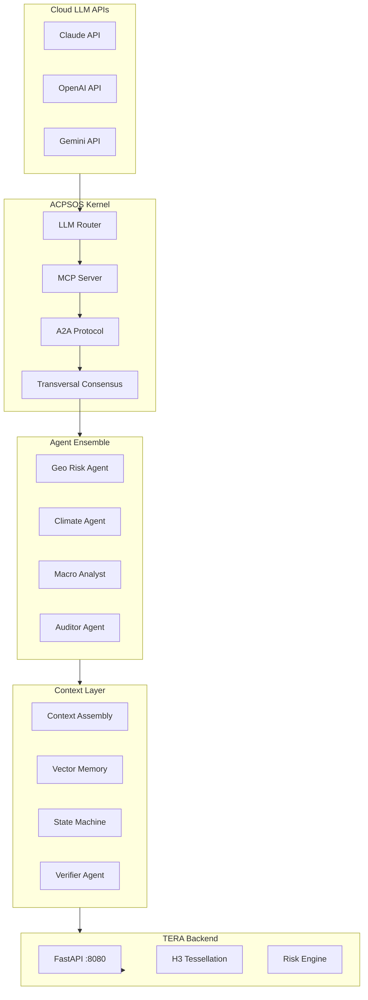

# ACPSOS - Agent Context Plurality Spectrum OS

## Architektur-Uebersicht



## Server-Ressourcen (vorhanden)

| Ressource | Verfuegbar | Fuer ACPSOS |

|-----------|------------|-------------|

| RAM | 57 GB frei | Ausreichend |

| Storage | 362 GB frei | Ausreichend |

| Python | 3.10.12 | OK |

| Docker | 28.2.2 | OK |

## Projektstruktur

```
/data/acpsos/
├── core/                    # Kernel & Orchestration
│   ├── kernel.py            # ACPSOS Hauptkernel
│   ├── router.py            # Multi-LLM Router
│   └── config.py            # API Keys & Settings
├── protocols/               # MCP & A2A
│   ├── mcp_server.py        # Model Context Protocol Server
│   ├── a2a_protocol.py      # Agent-to-Agent Protocol
│   └── tools/               # MCP Tool Definitionen
├── context/                 # Context Engineering Layer
│   ├── assembly.py          # Context Assembly Engine
│   ├── memory.py            # ChromaDB Vector Memory
│   ├── state.py             # LangGraph State Machine
│   └── verifier.py          # Audit/Verification Agent
├── agents/                  # Spezialisierte Agenten
│   ├── base_agent.py        # Agent Basisklasse
│   ├── geo_risk_agent.py    # Geospatial Risk Analyst
│   ├── climate_agent.py     # Climate Impact Analyst
│   ├── macro_agent.py       # Macro/Liquidity Analyst
│   └── auditor_agent.py     # Verifier/Auditor
├── consensus/               # Transversal Consensus
│   ├── gram_matrix.py       # Gram-Matrix Berechnung
│   ├── diversity_loss.py    # Geometric Diversity Loss
│   └── ensemble.py          # Agent Ensemble Orchestration
├── tera_bridge/             # TERA Integration
│   ├── api_client.py        # TERA API Client
│   ├── risk_tools.py        # MCP Tools fuer TERA
│   └── schemas.py           # Pydantic Schemas
├── requirements.txt         # Python Dependencies
├── docker-compose.yml       # ChromaDB, Redis, etc.
└── main.py                  # Entry Point
```

## Phase 1: Core Infrastructure (Tag 1)

### 1.1 Projektstruktur erstellen

- Verzeichnisse auf dem Server anlegen
- Python venv mit Dependencies

### 1.2 Dependencies ([requirements.txt])

```
# LLM APIs
anthropic>=0.40.0
openai>=1.50.0
google-generativeai>=0.8.0

# Orchestration
dspy-ai>=2.5.0
langgraph>=0.2.0

# Vector DB & Memory
chromadb>=0.5.0
sentence-transformers>=3.0.0

# MCP Protocol
mcp>=1.0.0

# TERA Integration
httpx>=0.27.0
h3>=3.7.0

# Utilities
pydantic>=2.0.0
loguru>=0.7.0
python-dotenv>=1.0.0
numpy>=1.26.0
torch>=2.0.0
```

### 1.3 Docker Services

- ChromaDB (Vector Store)
- Redis (Message Queue fuer A2A)

## Phase 2: Core Kernel (Tag 1-2)

### 2.1 Multi-LLM Router ([core/router.py])

```python
class LLMRouter:
    def __init__(self):
        self.claude = anthropic.Anthropic()
        self.openai = OpenAI()
        self.gemini = genai.GenerativeModel()
    
    async def route(self, task_type, prompt, context):
        # Routing basierend auf Task-Typ
        if task_type == "analysis": return await self.claude()
        if task_type == "code": return await self.openai()
        if task_type == "multimodal": return await self.gemini()
```

### 2.2 MCP Server ([protocols/mcp_server.py])

- Tool-Definitionen fuer TERA APIs
- `analyze_city`, `get_risk_map`, `get_climate_projection`

### 2.3 A2A Protocol ([protocols/a2a_protocol.py])

- Agent Card Registration
- Task Delegation
- Artifact Passing

## Phase 3: Context Engineering Layer (Tag 2-3)

### 3.1 Context Assembly ([context/assembly.py])

- Modulare Kontext-Pakete
- Token Budget Management
- Prioritaetssystem nach Impact

### 3.2 Vector Memory ([context/memory.py])

- ChromaDB Integration
- Short-term (Session) vs Long-term (Persistent)
- Hybrid Retrieval (Dense + Sparse)

### 3.3 State Machine ([context/state.py])

- LangGraph fuer Agent Workflows
- Checkpointing fuer Audit Trail

## Phase 4: Transversal Consensus (Tag 3-4)

### 4.1 Gram Matrix ([consensus/gram_matrix.py])

```python
def compute_gram_matrix(embeddings: torch.Tensor) -> torch.Tensor:
    h_norm = F.normalize(embeddings, p=2, dim=-1)
    return torch.bmm(h_norm, h_norm.transpose(1, 2))
```

### 4.2 Diversity Loss ([consensus/diversity_loss.py])

- Implementierung der Formel aus dem Paper
- `L_geom = -log det(G + epsilon*I)`

### 4.3 Ensemble Orchestration ([consensus/ensemble.py])

- Parallel Agent Execution
- Transversal Voting/Aggregation

## Phase 5: Agent Ensemble (Tag 4-5)

### 5.1 Base Agent ([agents/base_agent.py])

- DSPy Module Integration
- MCP Tool Access
- Context Injection

### 5.2 Spezialisierte Agenten

| Agent | Rolle | Tools |

|-------|-------|-------|

| GeoRiskAgent | Geospatial Analyse | TERA API, H3 Grid |

| ClimateAgent | Klimaprojektion | IPCC Data, Scenarios |

| MacroAgent | Makro-Indikatoren | Liquidity, Commodities |

| AuditorAgent | Verifikation | Source Check, Audit |

## Phase 6: TERA Bridge (Tag 5-6)

### 6.1 API Client ([tera_bridge/api_client.py])

- Async Client fuer TERA Backend
- `/api/analysis/analyze`
- `/api/analysis/risk-map`

### 6.2 MCP Tools ([tera_bridge/risk_tools.py])

```python
@mcp.tool()
def analyze_city(city: str) -> RiskReport:
    """Analysiert eine Stadt mit TERA Risk Intelligence"""
    return tera_client.analyze(city)

@mcp.tool()
def get_hexagon_details(h3_index: str) -> HexagonDetail:
    """Liefert Details zu einer spezifischen Risikozelle"""
    return tera_client.get_cell(h3_index)
```

## Phase 7: Integration & Testing (Tag 6-7)

### 7.1 End-to-End Flow

```
User Query -> Router -> Agents (parallel) 
           -> Transversal Consensus 
           -> TERA Tools 
           -> Verified Report
```

### 7.2 Demo Workflow

"Analysiere Miami, Jakarta und Berlin mit Multi-Agent Ensemble"

## Risiken & Mitigationen

| Risiko | Mitigation |

|--------|------------|

| API Kosten (Cloud LLMs) | Rate Limiting, Caching, Token Budget |

| Latenz (multiple Agents) | Parallel Execution, Async I/O |

| Context Window Limits | Chunking, Summarization |

| Keine GPU | CPU-optimierte Embeddings (BGE-M3) |

## Erfolgsmetriken

1. Multi-Agent Konsens funktioniert geometrisch korrekt
2. TERA-Integration liefert echte Risikodaten
3. MCP Tools sind von Cursor/Claude nutzbar
4. Audit Trail komplett nachvollziehbar