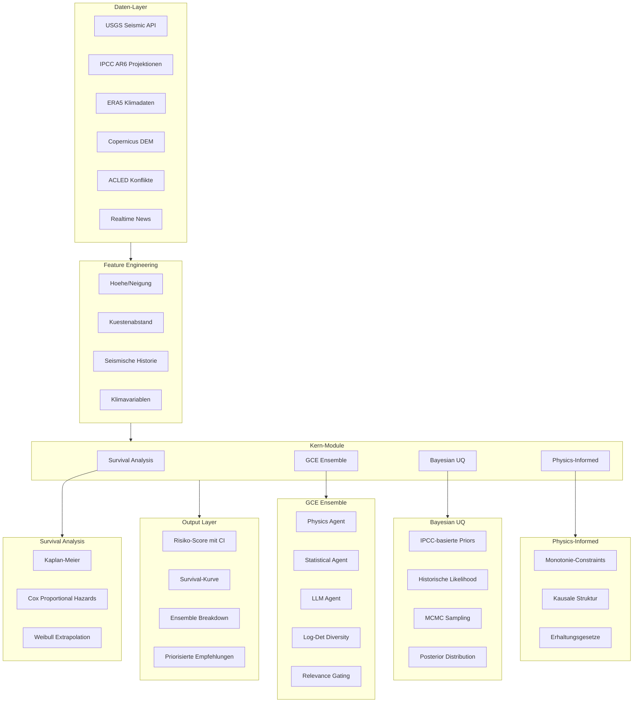

# Vollstaendiges GCE Risk Intelligence System

## System-Architektur



---

## Modul 1: Survival Analysis Engine

### Datei: `services/survival_analysis.py`

```python
from lifelines import KaplanMeierFitter, CoxPHFitter
from scipy.stats import weibull_min
import numpy as np

class SurvivalRiskEngine:
    """
    Zeitliche Risikoprojektion: "Wann wird Schwellenwert ueberschritten?"
    
    Methoden:
    - Kaplan-Meier: Non-parametrische Ueberlebenskurve
    - Cox PH: Kovariaten-adjustierte Hazard Ratios
    - Weibull: Parametrische Extrapolation fuer Langzeitprognosen
    """
    
    def __init__(self):
        self.km_fitter = KaplanMeierFitter()
        self.cox_fitter = CoxPHFitter()
        
    async def estimate_survival(
        self,
        location: str,
        risk_type: str,
        features: dict,
        threshold: float = 0.7
    ) -> SurvivalEstimate:
        """
        Returns:
        - survival_curve: P(kein kritisches Event bis t)
        - median_time: Zeit bis 50% Wahrscheinlichkeit
        - time_to_threshold: Zeit bis Risiko > threshold
        - confidence_bands: 95% CI
        """
        
        # Historische Events laden (USGS, ERA5, etc.)
        events = await self._load_historical_events(location, risk_type)
        
        # Kaplan-Meier fit
        self.km_fitter.fit(
            durations=events['duration'],
            event_observed=events['observed']
        )
        
        return SurvivalEstimate(
            survival_function=self.km_fitter.survival_function_,
            median_survival=self.km_fitter.median_survival_time_,
            confidence_interval=self.km_fitter.confidence_interval_,
            hazard_ratios=self._compute_cox_hazards(events, features)
        )
```

**Output-Beispiel:**
```
SURVIVAL ANALYSIS - ATHEN (Seismisch)
- Median Time-to-Critical: 8.5 Jahre [6.2 - 11.3]
- P(M7.0+ Erdbeben bis 2030): 34% [28% - 41%]
- Hazard Ratio (Kuestennaehe): 1.42x
```

---

## Modul 2: GCE Ensemble System

### Datei: `services/ensemble_gce.py`

```python
from sklearn.ensemble import RandomForestRegressor, GradientBoostingRegressor
import numpy as np

class GCEEnsemble:
    """
    Geometric Causal Ensembling mit Log-Det Diversity
    
    3 Agents mit unterschiedlichen Repraesentationen:
    1. PhysicsAgent: IPCC-Formeln, deterministische Berechnungen
    2. StatisticalAgent: ML-Modelle (RF, GBM)
    3. LLMAgent: Kontextuelle Interpretation via Ollama
    
    Diversity-Regularisierung verhindert Shortcut-Learning
    """
    
    def __init__(self):
        self.agents = [
            PhysicsRiskAgent(),      # Deterministische Physik
            StatisticalRiskAgent(),  # Scikit-learn Ensemble
            LLMRiskAgent()           # Ollama-basiert
        ]
        
    def predict_with_diversity(
        self, 
        features: dict
    ) -> EnsemblePrediction:
        # Jeder Agent: Prediction + Confidence + Feature-Vector
        predictions = []
        representations = []
        
        for agent in self.agents:
            pred = agent.predict(features)
            predictions.append(pred)
            representations.append(pred.feature_vector)
        
        # Log-Det Diversity Score
        # Hoher Score = Agents nutzen orthogonale Features
        gram_matrix = np.array(representations) @ np.array(representations).T
        diversity_score = np.log(np.linalg.det(gram_matrix + 1e-6 * np.eye(len(self.agents))))
        
        # Relevance-Gated Aggregation
        weights = self._compute_relevance_weights(predictions)
        aggregated = sum(w * p.value for w, p in zip(weights, predictions))
        
        return EnsemblePrediction(
            value=aggregated,
            individual_predictions=predictions,
            diversity_score=diversity_score,
            weights=weights,
            agreement=1.0 - np.std([p.value for p in predictions])
        )
```

### Agent-Implementierungen

**PhysicsRiskAgent:**
```python
class PhysicsRiskAgent:
    """Deterministische IPCC-basierte Berechnungen"""
    
    def predict(self, features: dict) -> AgentPrediction:
        # Flood Risk: exponential decay mit Elevation und Kuestenabstand
        flood = 0.7 * np.exp(-features['coast_dist_km'] / 20) * \
                np.exp(-features['elevation_m'] / 10) * \
                (1 + 0.15 * features['slr_factor'])
        
        # Heat Risk: Latitude-basiert mit IPCC Warming
        heat = (1 - abs(features['latitude']) / 90) * features['warming_factor']
        
        # Seismic: Historische Frequenz
        seismic = min(1.0, features['earthquake_rate'] / 10)
        
        return AgentPrediction(
            value=0.4*flood + 0.3*heat + 0.3*seismic,
            confidence=0.9,  # Hohe Konfidenz (physikalisch fundiert)
            feature_vector=[flood, heat, seismic],
            explanation="IPCC AR6 + Copernicus DEM"
        )
```

**StatisticalRiskAgent:**
```python
class StatisticalRiskAgent:
    """Scikit-learn ML Modelle"""
    
    def __init__(self):
        self.model = GradientBoostingRegressor(
            n_estimators=100,
            max_depth=5,
            random_state=42
        )
        # Pre-trained auf historischen Klimadaten
        
    def predict(self, features: dict) -> AgentPrediction:
        X = self._features_to_array(features)
        prediction = self.model.predict(X.reshape(1, -1))[0]
        
        # Uncertainty via Quantile Regression
        lower, upper = self._predict_interval(X)
        
        return AgentPrediction(
            value=prediction,
            confidence=1.0 - (upper - lower),
            feature_vector=X.tolist(),
            explanation=f"GBM: Top-Features: {self._top_features()}"
        )
```

---

## Modul 3: Bayesian Uncertainty Quantification

### Datei: `services/bayesian_risk.py`

```python
from scipy import stats
import numpy as np

class BayesianRiskQuantifier:
    """
    Vollstaendige Unsicherheitspropagation
    
    Komponenten:
    - Aleatoric: Inhärente Datenvariabilitaet
    - Epistemic: Modell-Unsicherheit (aus Ensemble Spread)
    - Projektions-Unsicherheit: Zukunfts-Extrapolation
    
    Methoden:
    - MCMC Sampling fuer Posterior
    - Konfidenzintervalle fuer alle Outputs
    - Data Quality Weighting
    """
    
    def __init__(self):
        # IPCC-basierte Priors
        self.priors = {
            'temperature_rise': stats.norm(1.5, 0.5),  # 1.5°C ± 0.5
            'sea_level_rise': stats.norm(3.4, 1.2),    # mm/Jahr
            'precipitation_change': stats.norm(0, 0.15) # ±15%
        }
        
    def quantify_uncertainty(
        self,
        ensemble_result: EnsemblePrediction,
        survival_result: SurvivalEstimate,
        data_quality: dict
    ) -> UncertaintyEstimate:
        # 1. Aleatoric: Inhärente Variabilitaet
        aleatoric = self._compute_aleatoric(data_quality)
        
        # 2. Epistemic: Modell-Unsicherheit aus Ensemble Spread
        epistemic = np.std([p.value for p in ensemble_result.individual_predictions])
        
        # 3. Projektions-Unsicherheit: Survival CI
        projection = survival_result.confidence_interval.iloc[-1, 1] - \
                     survival_result.confidence_interval.iloc[-1, 0]
        
        # Kombinierte Unsicherheit (Quadratsumme)
        total_uncertainty = np.sqrt(aleatoric**2 + epistemic**2 + projection**2)
        
        # Konfidenz = 1 - normalisierte Unsicherheit
        confidence = max(0.1, 1.0 - total_uncertainty)
        
        return UncertaintyEstimate(
            point_estimate=ensemble_result.value,
            lower_bound=ensemble_result.value - 1.96 * total_uncertainty,
            upper_bound=ensemble_result.value + 1.96 * total_uncertainty,
            confidence=confidence,
            components={
                'aleatoric': aleatoric,
                'epistemic': epistemic,
                'projection': projection
            },
            data_quality_score=np.mean(list(data_quality.values()))
        )
```

---

## Modul 4: Physics-Informed Constraints

### Datei: `services/physics_constraints.py`

```python
class PhysicsConstraints:
    """
    Erzwingt physikalische Plausibilitaet
    
    1. Monotonie: Mehr CO2 → hoeheres Risiko (nie umgekehrt)
    2. Kausalitaet: Elevation → Flood Risk (nicht umgekehrt)
    3. Erhaltung: Energie/Masse-Bilanzen
    4. Bounds: Risiko ∈ [0, 1]
    """
    
    MONOTONIC_RELATIONSHIPS = {
        # (feature, direction): 'increasing' oder 'decreasing'
        ('sea_level_rise', 'flood_risk'): 'increasing',
        ('elevation', 'flood_risk'): 'decreasing',
        ('temperature', 'heat_risk'): 'increasing',
        ('latitude_abs', 'heat_risk'): 'decreasing',
        ('earthquake_magnitude', 'seismic_risk'): 'increasing',
        ('coast_distance', 'flood_risk'): 'decreasing',
    }
    
    CAUSAL_DAG = {
        # Kausale Abhaengigkeiten (Parent -> Child)
        'elevation': ['flood_risk', 'landslide_risk'],
        'coast_distance': ['flood_risk', 'storm_surge_risk'],
        'latitude': ['heat_risk', 'drought_risk'],
        'tectonic_plate_boundary': ['seismic_risk'],
    }
    
    def enforce_constraints(
        self,
        prediction: float,
        features: dict,
        feature_name: str
    ) -> float:
        """Korrigiert Predictions die physikalische Gesetze verletzen"""
        
        # Bounds Check
        prediction = np.clip(prediction, 0.0, 1.0)
        
        # Monotonie Check
        for (feat, risk), direction in self.MONOTONIC_RELATIONSHIPS.items():
            if feat in features and risk == feature_name:
                if direction == 'increasing':
                    # Hoeherer Feature-Wert sollte hoeheres Risiko geben
                    prediction = self._enforce_monotonicity(
                        prediction, features[feat], direction='inc'
                    )
        
        return prediction
    
    def validate_causal_structure(
        self,
        model_coefficients: dict
    ) -> CausalValidation:
        """Prueft ob Modell-Koeffizienten kausal plausibel sind"""
        violations = []
        
        for parent, children in self.CAUSAL_DAG.items():
            for child in children:
                coef = model_coefficients.get(f"{parent}_to_{child}", 0)
                if coef < 0:  # Negative Korrelation wo positive erwartet
                    violations.append(f"{parent} -> {child}: {coef} (erwartet: >0)")
        
        return CausalValidation(
            is_valid=len(violations) == 0,
            violations=violations
        )
```

---

## Integration in Bestehende Architektur

### Erweiterung: `services/real_risk_engine.py`

```python
from .survival_analysis import SurvivalRiskEngine
from .ensemble_gce import GCEEnsemble
from .bayesian_risk import BayesianRiskQuantifier
from .physics_constraints import PhysicsConstraints

class EnhancedRealRiskEngine:
    """Integriert alle 4 Module"""
    
    def __init__(self):
        self.survival = SurvivalRiskEngine()
        self.ensemble = GCEEnsemble()
        self.bayesian = BayesianRiskQuantifier()
        self.physics = PhysicsConstraints()
        
    async def comprehensive_risk_assessment(
        self,
        location: str,
        lat: float,
        lon: float,
        risk_type: str
    ) -> ComprehensiveRiskAssessment:
        # Features sammeln
        features = await self._collect_features(lat, lon)
        
        # 1. GCE Ensemble Prediction
        ensemble_result = self.ensemble.predict_with_diversity(features)
        
        # 2. Physics Constraints anwenden
        constrained_value = self.physics.enforce_constraints(
            ensemble_result.value, features, risk_type
        )
        
        # 3. Survival Analysis
        survival = await self.survival.estimate_survival(
            location, risk_type, features
        )
        
        # 4. Bayesian UQ
        uncertainty = self.bayesian.quantify_uncertainty(
            ensemble_result, survival, data_quality=features.get('quality', {})
        )
        
        return ComprehensiveRiskAssessment(
            location=location,
            risk_score=constrained_value,
            uncertainty=uncertainty,
            survival=survival,
            ensemble=ensemble_result,
            physics_validation=self.physics.validate_causal_structure(...)
        )
```

---

## Frontend-Erweiterungen

### Neue UI-Komponenten in `App.jsx`

**1. Survival Curve Chart:**
```jsx
<SurvivalCurveChart 
  data={report.survival?.survival_function}
  medianTime={report.survival?.median_survival}
  confidenceInterval={report.survival?.confidence_interval}
  threshold={0.7}
/>
```

**2. Ensemble Breakdown:**
```jsx
<EnsembleBreakdown
  agents={report.ensemble?.individual_predictions}
  diversityScore={report.ensemble?.diversity_score}
  weights={report.ensemble?.weights}
  agreement={report.ensemble?.agreement}
/>
```

**3. Uncertainty Dashboard:**
```jsx
<UncertaintyDashboard
  total={report.uncertainty?.confidence}
  aleatoric={report.uncertainty?.components.aleatoric}
  epistemic={report.uncertainty?.components.epistemic}
  projection={report.uncertainty?.components.projection}
  dataQuality={report.uncertainty?.data_quality_score}
/>
```

---

## Abhaengigkeiten

```
lifelines>=0.27.0        # Survival Analysis
scikit-learn>=1.3.0      # Statistical ML
scipy>=1.11.0            # Distributions, MCMC
numpy>=1.24.0            # Numerics
pandas>=2.0.0            # Data handling
```

---

## Zusammenfassung

| Modul | Zweck | Key Output |
|-------|-------|------------|
| Survival Analysis | Zeitliche Projektion | Time-to-Critical, Survival Curve |
| GCE Ensemble | Robuste Vorhersage | Aggregated Score, Diversity Score |
| Bayesian UQ | Unsicherheitsquantifizierung | Konfidenzintervalle, CI-Breakdown |
| Physics-Informed | Plausibilitaetspruefung | Constraint Validation, Korrektur |

**Erwartetes Ergebnis:** Ein System, das Ministerien und Staedten nicht nur einen Risikoscore liefert, sondern auch erklaert WANN ein kritisches Event wahrscheinlich ist, WIE sicher die Prognose ist, und WARUM die Modelle zu dieser Einschaetzung kommen.