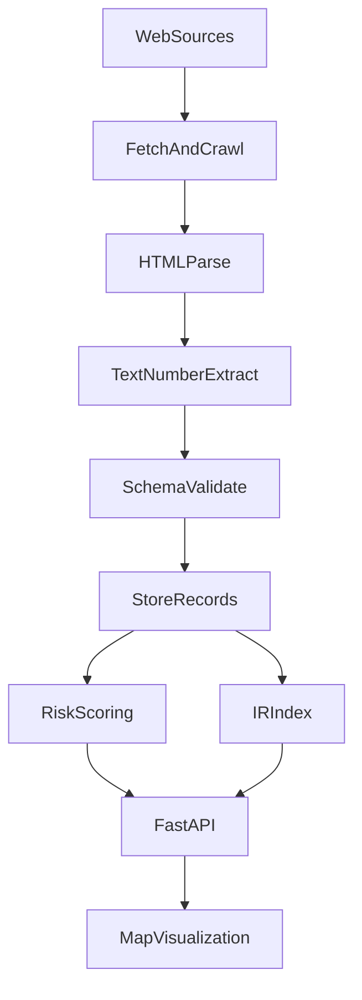

# 🌍 TERA - Terrestrial Environmental Risk Analysis

**Data & Web Mining Project | Geospatial Risk Intelligence Platform**

TERA is a comprehensive data mining and web scraping platform that analyzes climate risks, conflicts, and environmental hazards for cities worldwide. The system combines web crawling, text mining, information retrieval, and geospatial visualization to provide actionable risk intelligence.

[](https://opensource.org/licenses/MIT)
[](https://www.python.org/downloads/)
[](https://reactjs.org/)
[](https://fastapi.tiangolo.com/)

---

## 📋 Project Overview

TERA consists of two main components:

1. **Data Mining Pipeline** (`mining/`) - Web scraping, text extraction, and risk scoring
2. **Web Application** (`app/`) - Interactive 3D visualization and API server

### Key Capabilities

- 🕷️ **Multi-Source Web Crawling** - NASA, UN Press, World Bank, WFP
- 📊 **Text Mining & Extraction** - Regex patterns, TF-IDF, embeddings
- 🔍 **Information Retrieval** - ChromaDB vector search, cosine similarity
- 🗺️ **Geospatial Visualization** - H3 hexagonal grids, 3D risk maps
- 📈 **Risk Scoring** - Keyword-based classification, multi-hazard analysis

---

## 🏗️ Project Structure

```
tera-geospatial/
├── README.md                    # This file - single source of truth
├── requirements.txt             # Python dependencies
├── docker-compose.yml           # Docker configuration
├── Dockerfile                   # Docker image definition
│
├── docs/                        # Documentation
│   └── PROJEKTBERICHT_UNIVERSITAET.md  # University report (German)
│
├── mining/                      # Data Mining Pipeline
│   ├── extractors.py            # Source-specific web scrapers
│   ├── data_extraction.py       # Numerical/text extraction (regex)
│   ├── risk_scoring.py          # Risk calculation engine
│   ├── database.py              # SQLite database manager
│   ├── schemas.py                # Data schemas (Pydantic)
│   ├── geocoding.py             # Geocoding service
│   ├── fetchers.py              # HTTP fetchers (requests/playwright)
│   ├── config.py                # Configuration management
│   ├── validators.py            # Data validation
│   ├── compliance.py            # robots.txt compliance checker
│   ├── url_lists.py             # URL sources for crawling
│   └── requirements.txt         # Mining dependencies
│
├── app/                         # Web Application
│   ├── backend/                 # FastAPI backend
│   │   ├── api/                 # API routes
│   │   ├── services/            # Business logic
│   │   ├── models/              # Data models
│   │   └── main.py              # FastAPI application
│   └── frontend/                # React frontend
│       ├── src/
│       │   ├── App.jsx          # Main component
│       │   └── components/     # React components
│       └── package.json
│
├── data/                        # Data storage
│   └── storage_metadata.json
│
└── terraform/                   # Infrastructure (optional)
    └── ...
```

---

## 🔬 Data & Web Mining Components

### End-to-End Mining Workflow (Text + Web Mining)



**What this proves for the course:**
- Web mining: crawl + parse + compliance checks
- Text mining: regex extraction + keyword scoring
- IR: TF-IDF / embeddings to retrieve relevant context

### 1. Web Crawling (`mining/extractors.py`)

**Multi-Agent Architecture:**
- **Compliance Agent** - Checks robots.txt before crawling
- **Fetch Agent** - HTTP requests with Playwright fallback
- **Extract Agent** - Source-specific extractors (BeautifulSoup)
- **Validate Agent** - Schema validation

**Supported Sources:**
- **NASA Earth Observatory** - Climate events, satellite data
- **UN Press** - Conflict events, Security Council mentions
- **World Bank** - Economic data, project funding
- **World Food Programme** - Humanitarian crises

### 2. Text Mining (`mining/data_extraction.py`)

**Regex-Based Extraction:**
- Temperatures (°C/°F conversion)
- Precipitation (mm/inches conversion)
- Population numbers (million/billion handling)
- Financial amounts (USD with multipliers)
- Percentages, dates, locations

**Example:**
```python
extractor = NumberExtractor()
result = extractor.extract_all(text)
# Returns: temperatures, precipitation, population_numbers, financial_amounts
```

### 3. Information Retrieval

**TF-IDF Vectorization:**
- Document-term matrix with scikit-learn
- Cosine similarity for ranking
- N-gram support (unigrams + bigrams)

**Embedding-Based Search:**
- ChromaDB vector database
- Sentence-Transformers embeddings
- Semantic similarity search

### 4. Risk Scoring (`mining/risk_scoring.py`)

**Keyword-Based Classification:**
- Climate indicators: drought, flood, heat_wave, famine
- Conflict indicators: war, violence, displacement, refugee
- Urgency indicators: critical, emergency, severe

**Scoring Formula:**
```
Total Score = (Climate Risk × 0.4) + (Conflict Risk × 0.4) + (Urgency × 0.2)
Risk Level: CRITICAL (≥0.8), HIGH (≥0.6), MEDIUM (≥0.4), LOW (≥0.2), MINIMAL (<0.2)
```

---

## 🚀 Quick Start

### Prerequisites

- Python 3.11+
- Node.js 18+
- SQLite (included with Python)

### Installation

```bash
# Clone repository
git clone https://github.com/YOUR_USERNAME/tera-geospatial.git
cd tera-geospatial

# Setup data mining pipeline
cd mining
python -m venv venv
source venv/bin/activate  # Linux/Mac: venv\Scripts\activate (Windows)
pip install -r requirements.txt

# Setup web application backend
cd ../app/backend
pip install -r requirements.txt

# Setup frontend
cd ../frontend
npm install
```

### Run Locally

```bash
# Terminal 1: Start Backend API
cd app/backend
python -m uvicorn main:app --host 0.0.0.0 --port 8080

# Terminal 2: Start Frontend
cd app/frontend
npm run dev -- --port 3006

# Terminal 3: Run Data Mining Pipeline (optional)
cd mining
python -c "from extractors import NASAExtractor; print('Mining pipeline ready')"
```

### Access

| Service | URL |
|---------|-----|
| 🌐 Frontend | http://localhost:3006 |
| 🔧 API | http://localhost:8080 |
| 📚 API Docs | http://localhost:8080/docs |

---

## 📊 Data Mining Pipeline Usage

### Web Crawling

```python
from mining.extractors import NASAExtractor, ExtractorFactory
from mining.fetchers import Fetcher

# Initialize extractor
extractor = NASAExtractor()

# Fetch and extract
fetcher = Fetcher()
result = fetcher.fetch("https://earthobservatory.nasa.gov/images/...")
record = extractor.extract(result)

# Store in database
from mining.database import DatabaseManager
db = DatabaseManager()
db.insert_record(record)
```

### Text Extraction

```python
from mining.data_extraction import NumberExtractor

extractor = NumberExtractor()
text = "Temperature reached 35°C. 2 million people affected. $500M funding allocated."
result = extractor.extract_all(text)

print(result.temperatures)      # [35.0]
print(result.population_numbers) # [2000000]
print(result.financial_amounts)  # [500000000.0]
```

### Risk Scoring

```python
from mining.risk_scoring import RiskScorer

scorer = RiskScorer()
record = {
    'title': 'Severe drought in East Africa',
    'summary': 'Worst drought in 40 years causes food crisis',
    'region': 'East Africa'
}

risk = scorer.calculate_risk(record)
print(f"Risk Level: {scorer.get_risk_level(risk.score)}")  # CRITICAL
print(f"Score: {risk.score:.2f}")  # 0.85
```

---

## 🗺️ Web Application Features

### 3D Hexagonal Risk Maps

- **H3 Grid** - Uber's hexagonal tessellation (~1,376 cells per city)
- **3D Visualization** - MapLibre GL with fill-extrusion layers
- **Risk Categories** - Coastal flood, drought, heat stress, seismic, conflict
- **IPCC Scenarios** - SSP1-1.9, SSP2-4.5, SSP5-8.5 projections (2025-2100)

### API Endpoints

```bash
# Analyze a city
POST /api/analysis/analyze
Body: { "location": "Miami" }

# Get risk map (H3 hexagons)
GET /api/analysis/risk-map?city=Miami&resolution=8

# Get professional analysis
GET /api/analysis/professional?city=Miami
```

---

## 📡 Data Sources

| Source | Type | Update Frequency | Usage |
|--------|------|------------------|-------|
| NASA Earth Observatory | Climate | Daily | Environmental indicators, satellite data |
| UN Press | Conflicts | Real-time | Security Council, meeting coverage |
| World Bank | Economic | Daily | Projects, sectors, funding |
| NASA FIRMS | Fire Detection | 3h | Active fires |
| USGS | Seismic | 5min | Earthquakes M2.5+ |
| IPCC AR6 | Climate | Static | SSP projections |

---

## 🛠️ Technology Stack

### Data Mining
- **Web Scraping**: BeautifulSoup4, Playwright
- **Text Processing**: Python `re`, NLTK
- **Information Retrieval**: scikit-learn (TF-IDF), ChromaDB, Sentence-Transformers
- **Database**: SQLite with SQLAlchemy
- **Data Validation**: Pydantic schemas

### Web Application
- **Backend**: FastAPI, Python 3.11, Uvicorn
- **Frontend**: React 18, MapLibre GL, Vite
- **Geospatial**: H3-Py (Uber), GeoJSON
- **Visualization**: 3D maps, animated hexagons

---

## 📚 Documentation

- **[docs/PROJEKTBERICHT_UNIVERSITAET.md](docs/PROJEKTBERICHT_UNIVERSITAET.md)** - Complete university project report (German)
- **[API Documentation](http://localhost:8080/docs)** - Interactive Swagger UI (when running)

---

## 🔬 Scientific Foundation

This project is based on:

1. **IPCC AR6 (2021)** - Climate Change: The Physical Science Basis
2. **Uber H3 (2018)** - Hexagonal Hierarchical Geospatial Indexing
3. **NASA Earth Science** - Satellite observation data
4. **Web Mining Best Practices** - robots.txt compliance, rate limiting, error handling

---

## 📝 License

MIT License - see [LICENSE](LICENSE) for details.

---

## 🤝 Contributing

Contributions are welcome! Please:

1. Fork the repository
2. Create a feature branch (`git checkout -b feature/AmazingFeature`)
3. Commit your changes (`git commit -m 'Add AmazingFeature'`)
4. Push to the branch (`git push origin feature/AmazingFeature`)
5. Open a Pull Request

---

**Built for Data & Web Mining course | University Project 2026**

*"The best way to predict the future is to create it." - Alan Kay*
